---
format:
  revealjs:
    footer: "TFG - Christian González Pérez"
---

## {.title-slide .clean-title}

Trabajo de Fin de Grado - Ingeniería Aeroespacial

Control híbrido en cascada de un cuadricóptero

Sustitución neuronal de controladores especializados del lazo externo

PD especializados<i></i>controlador único

<strong>Autor</strong> Christian González Pérez

<strong>Tutores</strong> José Ramón Rodríguez Ossorio - Guzmán González Mateos

::: notes
0:00–0:40. Saludo, nombre y foco. No es un controlador neuronal completo: se sustituye una decisión concreta dentro de una arquitectura en cascada.
:::

## Una pregunta, cuatro pasos {.section-map .route-slide data-auto-fragments="10000"}

01<svg class="card-icon" viewBox="0 0 24 24" fill="none" stroke="currentColor" stroke-width="2" stroke-linecap="round" stroke-linejoin="round"><polygon points="12 2 2 7 12 12 22 7 12 2"/><polyline points="2 17 12 22 22 17"/><polyline points="2 12 12 17 22 12"/></svg>
<strong>Problema</strong><small>múltiples controladores</small>

<i>→</i>

02<svg class="card-icon" viewBox="0 0 24 24" fill="none" stroke="currentColor" stroke-width="2" stroke-linecap="round" stroke-linejoin="round"><rect x="4" y="4" width="16" height="16" rx="2" ry="2"/><rect x="9" y="9" width="6" height="6"/><line x1="9" y1="1" x2="9" y2="4"/><line x1="15" y1="1" x2="15" y2="4"/><line x1="9" y1="20" x2="9" y2="23"/><line x1="15" y1="20" x2="15" y2="23"/><line x1="20" y1="9" x2="23" y2="9"/><line x1="20" y1="15" x2="23" y2="15"/><line x1="1" y1="9" x2="4" y2="9"/><line x1="1" y1="15" x2="4" y2="15"/></svg>
<strong>Sustitución</strong><small>una interfaz interpretable</small>

<i>→</i>

03<svg class="card-icon" viewBox="0 0 24 24" fill="none" stroke="currentColor" stroke-width="2" stroke-linecap="round" stroke-linejoin="round"><line x1="4" y1="21" x2="4" y2="14"/><line x1="4" y1="10" x2="4" y2="3"/><line x1="12" y1="21" x2="12" y2="12"/><line x1="12" y1="8" x2="12" y2="3"/><line x1="20" y1="21" x2="20" y2="16"/><line x1="20" y1="12" x2="20" y2="3"/><line x1="1" y1="14" x2="7" y2="14"/><line x1="9" y1="8" x2="15" y2="8"/><line x1="17" y1="16" x2="23" y2="16"/></svg>
<strong>Experimento</strong><small>mismas condiciones</small>

<i>→</i>

04<svg class="card-icon" viewBox="0 0 24 24" fill="none" stroke="currentColor" stroke-width="2" stroke-linecap="round" stroke-linejoin="round"><path d="M22 11.08V12a10 10 0 1 1-5.93-9.14"/><polyline points="22 4 12 14.01 9 11.01"/></svg>
<strong>Resultado</strong><small>ID y OOD</small>

La comparación ocurre en <strong>bucle cerrado</strong>.

::: notes
0:40–1:10. Anticipar la lógica en una frase. Si se necesita recortar, resolver en 10 segundos.
:::

## De cuatro especialistas a un controlador común {.specialist-slide data-auto-fragments="0,20000"}

  
<strong>Hold</strong>Kp<code>4.50 · 4.50 · 11.25</code>Kd<code>1.50 · 1.50 · 3.00</code>

  
<strong>Circle</strong>Kp<code>4.35 · 4.35 · 10.88</code>Kd<code>2.87 · 2.87 · 5.74</code>

  
<strong>Lissajous</strong>Kp<code>5.65 · 5.65 · 14.11</code>Kd<code>3.80 · 3.80 · 7.60</code>

  
<strong>Waypoint</strong>Kp<code>5.44 · 5.44 · 13.61</code>Kd<code>2.40 · 2.40 · 4.80</code>

<svg viewBox="0 0 1000 100" preserveAspectRatio="none"><path d="M125 0 L125 16 C125 58 360 55 440 100"/><path d="M375 0 L375 16 C375 58 440 60 480 100"/><path d="M625 0 L625 16 C625 58 560 60 520 100"/><path d="M875 0 L875 16 C875 58 640 55 560 100"/></svg>

<svg viewBox="0 0 100 100" fill="none"><circle cx="50" cy="50" r="35"/><path d="M15 50h70M50 15v70M28 28l44 44M72 28L28 72"/></svg>

<strong>Un controlador - tres memorias</strong>

<b>MLP</b><small>instante actual</small><b>GRU</b><small>ventana temporal</small><b>LSTM</b><small>ventana temporal</small>

observación + referencia <b>→</b> fuerza deseada ENU

::: notes
1:10–2:20. Los valores ilustran que cada experto encapsula dos ternas de ganancias del lazo externo. La hipótesis es condensar el comportamiento del banco en un procedimiento común. Presentar las tres referencias. No prometer vuelo real ni robustez universal.
:::

## La estrategia experimental {.strategy-slide data-auto-fragments="2000,2500,3000"}

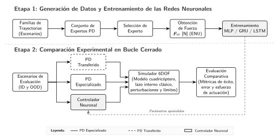

  1 Ajustar expertos
  2 Generar datos de fuerza
  3 Comparar ID / OOD

búsqueda global<i>→</i>filtro de seguridad<i>→</i>refinamiento local<i>→</i><strong>PD con parámetros fijados</strong>

::: notes
2:20–3:30. Recorrer de izquierda a derecha. Vehículo, referencias, perturbaciones, límites y métricas son comunes. No explicar herramientas ni carpetas. CONTROL: 3:30.
:::

## Para avanzar, el dron debe inclinarse {.physics-slide data-auto-fragments="2000,2500,3000,3500"}

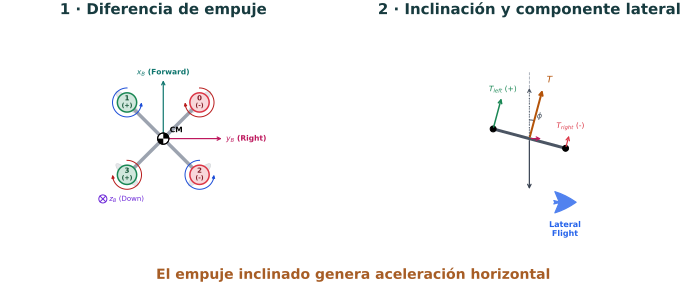

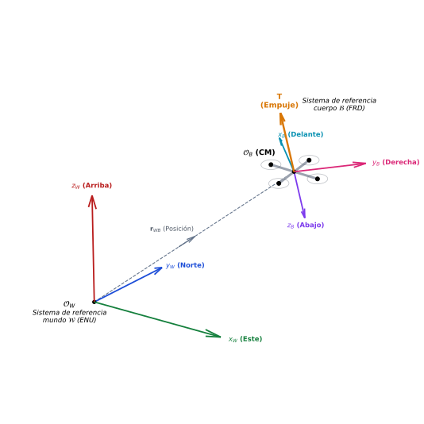

1<strong>Empuje desigual</strong><small>genera alabeo</small>

2<strong>Empuje inclinado</strong><small>aparece una componente horizontal</small>

3<strong>Movimiento lateral</strong><small>la actitud dirige la posición</small>

Mover posición exige controlar actitud.

::: notes
3:30–4:45. Física mínima. No derivar 6DOF, cuaterniones ni mixer. Si se acumula retraso, comprimir a 45 s.
:::

## Dos lazos, una interfaz física {.architecture-slide data-auto-fragments="0,2000,4500,5500"}

  
<small>lazo externo</small><strong>error posición + velocidad</strong>

  
→

  
<small>interfaz</small><strong>fuerza deseada ENU</strong>

  
→

  
<small>lazo interno</small><strong>actitud + momentos</strong>

  
→

  
<small>actuación</small><strong>mixer + rotores</strong>

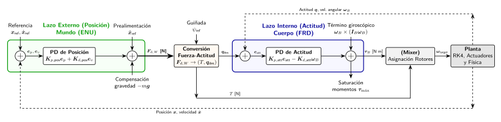

<strong>100 Hz</strong> física<strong>50 Hz</strong> control ZOH<strong>10 Hz</strong> telemetría

::: notes
4:45–6:10. Primero construir la lógica con cuatro bloques; después mostrar la arquitectura documentada completa. La fuerza es la frontera interpretable entre seguimiento y estabilización.
:::

## La red sustituye el lazo externo {.neural-slide data-auto-fragments="3000"}

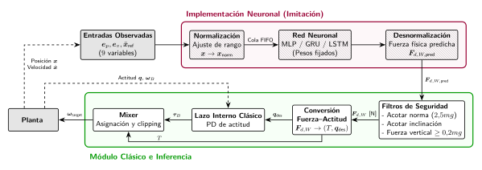

protecciones - fuerza–actitud - lazo interno - mixer - rotores

::: notes
6:10–7:20. La red entrega F_d,W. No manda rotores. Un fallo pertenece al sistema cerrado completo, no automáticamente solo a la red. CONTROL: 7:20.
:::

## De datos de fuerza a tres arquitecturas {.data-slide data-auto-fragments="2000,2500,3000,3500,4000"}

  
<strong>150</strong>episodios ID

  
105 entrenamiento22 validación23 prueba

  
→

  

<strong>MLP</strong>instante actual

<strong>GRU</strong>20 muestras

<strong>LSTM</strong>20 muestras

  <strong>Ventana recurrente</strong>
  
<i></i><i></i><i></i><i></i><i></i><i></i><i></i><i></i><i></i><i></i><i></i><i></i><i></i><i></i><i></i><i></i><i></i><i></i><i></i><i class="current"></i>

  20 muestras - 0,40 s

::: notes
7:20–8:35. Mismas entradas, objetivo y procedimiento. El objetivo es la fuerza del PD experto. No enumerar capas ni hiperparámetros.
:::

## Éxito tiene tres significados {.evidence-slide}

01
<svg class="evidence-icon" viewBox="0 0 120 88" fill="none" xmlns="http://www.w3.org/2000/svg" aria-hidden="true"><path d="M18 72H108" stroke="currentColor" stroke-width="1.4" stroke-linecap="round"/><path d="M22 12V72" stroke="currentColor" stroke-width="1.4" stroke-linecap="round"/><path d="M22 58C34 58 38 28 50 28C62 28 66 52 78 48C90 44 96 24 108 22" stroke="#173b3f" stroke-width="3.4" stroke-linecap="round" stroke-linejoin="round"/><path d="M22 62C34 60 40 34 50 34C62 34 66 54 78 52C90 50 98 30 108 28" stroke="#a75d25" stroke-width="1.7" stroke-linecap="round" stroke-linejoin="round" stroke-dasharray="3.2 2.4"/><text x="28" y="12" fill="#173b3f" font-size="9" font-family="Segoe UI, Arial, sans-serif" font-weight="700">fuerza</text></svg>
<strong>Fidelidad</strong>
<small>¿imita la fuerza del experto?</small>

02
<svg class="evidence-icon" viewBox="0 0 120 88" fill="none" xmlns="http://www.w3.org/2000/svg" aria-hidden="true"><circle cx="38" cy="40" r="20" stroke="#173b63" stroke-width="2.2"/><circle cx="38" cy="20" r="3" fill="#173b63"/><circle cx="58" cy="40" r="3" fill="#173b63"/><circle cx="38" cy="60" r="3" fill="#173b63"/><circle cx="18" cy="40" r="3" fill="#173b63"/><path d="M78 24L96 30L100 48L86 62L72 50Z" stroke="#173b63" stroke-width="1.8" stroke-linejoin="round"/><circle cx="78" cy="24" r="2.8" fill="#a75d25"/><circle cx="96" cy="30" r="2.8" fill="#a75d25"/><circle cx="100" cy="48" r="2.8" fill="#a75d25"/><circle cx="86" cy="62" r="2.8" fill="#a75d25"/><circle cx="72" cy="50" r="2.8" fill="#a75d25"/><text x="8" y="82" fill="#173b63" font-size="8.5" font-family="Segoe UI, Arial, sans-serif" font-weight="600">familias vistas</text></svg>
<strong>Bucle cerrado - ID</strong>
<small>¿sigue familias conocidas?</small>

03
<svg class="evidence-icon" viewBox="0 0 120 88" fill="none" xmlns="http://www.w3.org/2000/svg" aria-hidden="true"><path d="M22 16H72V64H22Z" fill="#ead5bd" fill-opacity=".4" stroke="#a33b4b" stroke-width="2"/><path d="M30 26H54M30 34H60M30 42H48M30 50H56M30 58H44" stroke="#173b3f" stroke-width="1.45" stroke-linecap="round" opacity=".72"/><path d="M72 20L78 18L82 28L76 34L80 42L74 48L84 54L76 62L88 68" stroke="#a33b4b" stroke-width="1.55" stroke-linecap="round" stroke-linejoin="round" opacity=".9"/><path d="M78 24L86 22M80 36L90 32M78 50L92 48M82 60L94 66" stroke="#a33b4b" stroke-width="1.2" stroke-linecap="round" opacity=".55"/><circle cx="96" cy="28" r="1.4" fill="#a33b4b" opacity=".7"/><circle cx="102" cy="42" r="1.6" fill="#a33b4b" opacity=".55"/><circle cx="94" cy="54" r="1.3" fill="#a33b4b" opacity=".65"/><circle cx="106" cy="58" r="1.5" fill="#a33b4b" opacity=".5"/><path d="M88 36L92 40M98 50L102 46" stroke="#a33b4b" stroke-width="1.1" stroke-linecap="round" opacity=".45"/><text x="60" y="82" text-anchor="middle" fill="#a33b4b" font-size="8.5" font-family="Segoe UI, Arial, sans-serif" font-weight="600">generalización</text></svg>
<strong>Bucle cerrado - OOD</strong>
<small>¿qué ocurre fuera de cobertura?</small>

  error de fuerza
  error de posición
  RMSE - finalización - protecciones

::: notes
8:35–9:30. Test sigue perteneciendo a familias conocidas. Generalización fuerte solo en OOD. Error de fuerza (fidelidad), error de posición (ID) y en OOD se leen juntos RMSE, finalización y protecciones. CONTROL: 9:30.
:::

## La referencia clásica sorprende {.baseline-slide}

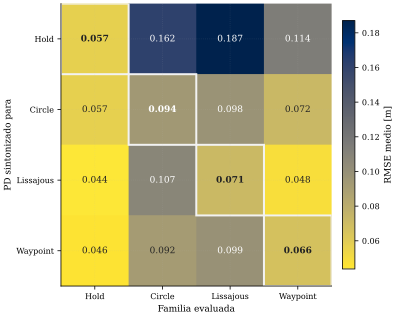

  
<strong>Especialización parcial</strong>la diagonal no domina siempre

  
<strong>Transferencia desigual</strong>depende de la geometría

  
<strong>Hold</strong>la sintonización no logra el mejor resultado de su familia

::: notes
9:30–10:40. No recorrer cada celda. El PD de hold transfiere peor; otras combinaciones funcionan bien. Si hay retraso: una sola conclusión en 30 s, ahorro 40 s.
:::

## Imitar mejor no implica controlar mejor {.fidelity-slide}

Test supervisado - RMSE de fuerza

Bucle cerrado - RMSE de posición

<strong>MLP</strong><i style="--v:100%"></i>0,083 N

<strong>GRU</strong><i style="--v:64%"></i>0,053 N

<strong>LSTM</strong><i style="--v:66%"></i>0,055 N

GRU y LSTM reproducen mejor la fuerza del PD.

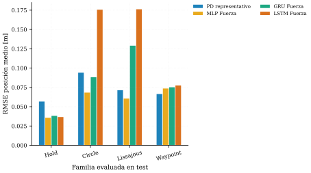

predicción<i>→</i>dinámica<i>→</i>nuevo estado<i>→</i>nueva predicción

<strong>MLP vence en circle y lissajous</strong>

::: notes
10:40–12:20. Contrastar explícitamente ambos niveles. El error se realimenta: una pequeña diferencia cambia el estado visitado y las predicciones siguientes. GRU/LSTM imitan mejor, pero MLP obtiene menor RMSE en circle y lissajous. CONTROL: 12:20.
:::

## Fuera de distribución aparece el límite {.ood-slide}

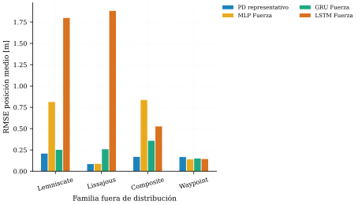

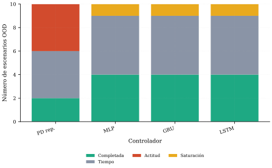

Sin red con dominio generalPD OOD elegido por similitud

Arquitectura × geometría × exigencia dinámica.

::: notes
12:20–14:00. GRU mejora frente a MLP en lemniscate y composite; MLP compite en variantes próximas a familias conocidas; LSTM se degrada en casos exigentes.
:::

## Los agregados esconden dónde falla {.diagnostic-slide}

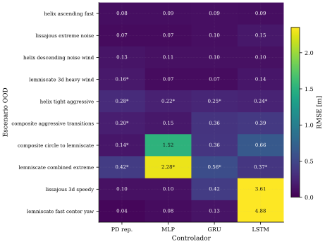

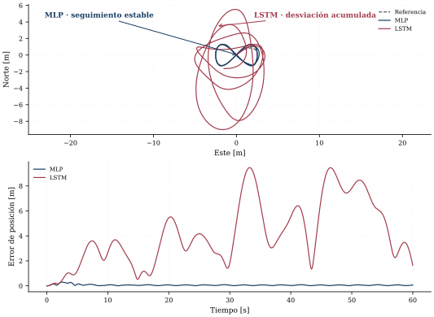

::: notes
14:00–15:40. Primero matriz: no leer todas las celdas. Después caso lemniscata: misma interfaz, estados visitados distintos; memoria temporal no aporta mejora automática. Recorte seguro: omitir el caso, ahorro 45 s.
:::

## El resultado pertenece al sistema completo {.protections-slide data-auto-fragments="1000,1500,2000,2500"}

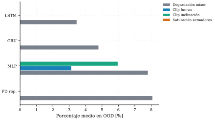

  
<strong>1</strong>clip de fuerza

  <i class="fragment" data-fragment-index="2">→</i>
  
<strong>2</strong>límite de inclinación

  <i class="fragment" data-fragment-index="3">→</i>
  
<strong>3</strong>degradación del mixer

  <i class="fragment" data-fragment-index="4">→</i>
  
<strong>4</strong>saturación

Completar con protecciones ≠ completar limpiamente.

::: notes
15:40–16:50. RMSE y seguridad se interpretan juntos. Emergencia: una sola conclusión en 25 s, ahorro 45 s. CONTROL: 16:50.
:::

## La hipótesis se cumple con matices {.conclusion-slide data-auto-fragments="500,1000,1500,2000,2500"}

  
01<strong>Sustitución viable</strong><small>en condiciones conocidas</small>

  
02<strong>Sin superioridad global</strong><small>ninguna arquitectura domina siempre</small>

  
03<strong>Imitación ≠ control</strong><small>la dinámica cierra el bucle</small>

  
04<strong>Generalización condicionada</strong><small>cobertura, geometría y límites</small>

Un controlador neuronal puede sustituir a los PD especializados.<strong>No iguala o mejora su comportamiento en condiciones completamente desconocidas.</strong>

::: notes
16:50–18:20. Responder explícitamente a la pregunta. Valor: comparación trazable para medir cuándo funciona y por qué se degrada. Futuro en una frase: ampliar cobertura e identificar un vehículo real. CONTROL: 18:20.
:::

## {.closing-slide .clean-title}

Conclusión

No se trata de demostrar que una red gana siempre, sino de identificar <strong>cuándo la sustitución es competitiva</strong> y dónde deja de serlo.

Gracias

::: notes
18:20–19:00. Frase final y agradecimiento. Terminar cerca de 19:00.
:::

## Respaldo - Sistemas de referencia ENU y FRD {.backup-slide}

## Respaldo - Ejecución multirrate {.backup-slide .backup-wide-title}

## Respaldo - Ajuste de expertos {.backup-slide}

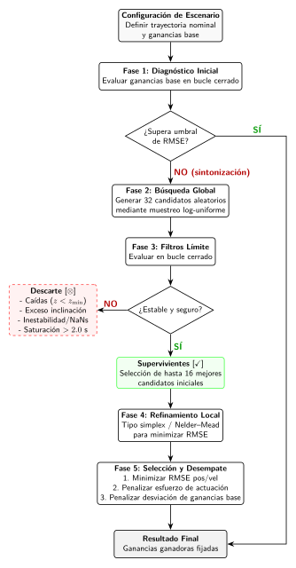

## Respaldo - Ventana recurrente {.backup-slide .backup-wide-title}

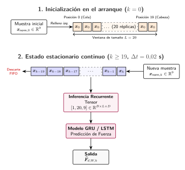

## Respaldo - Terminaciones OOD {.backup-slide}

